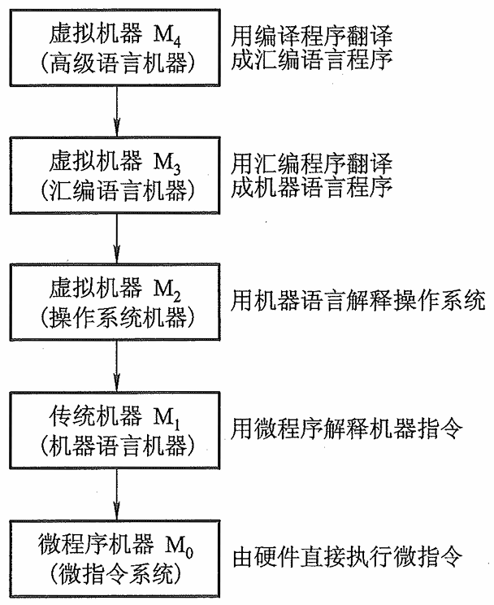
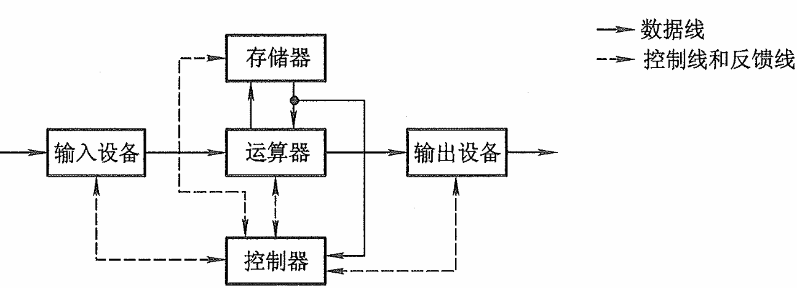
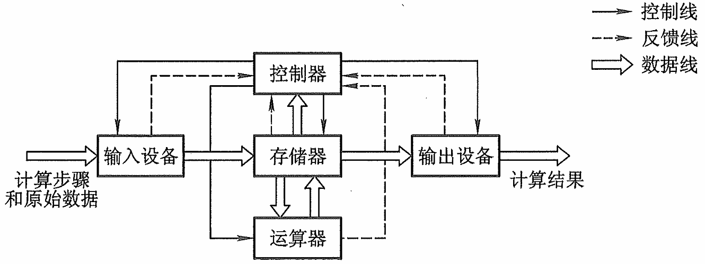
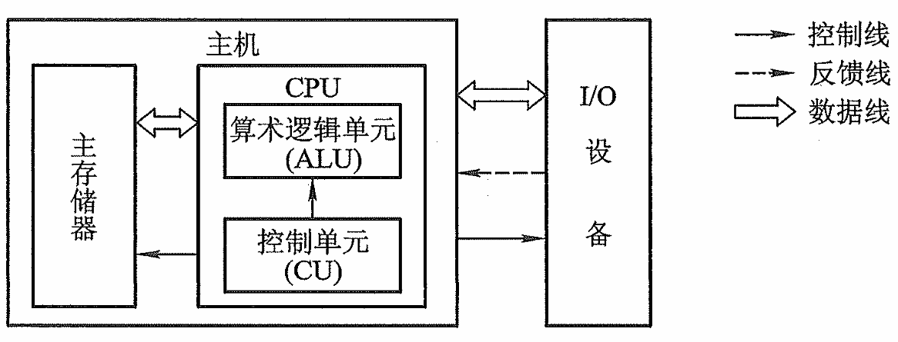
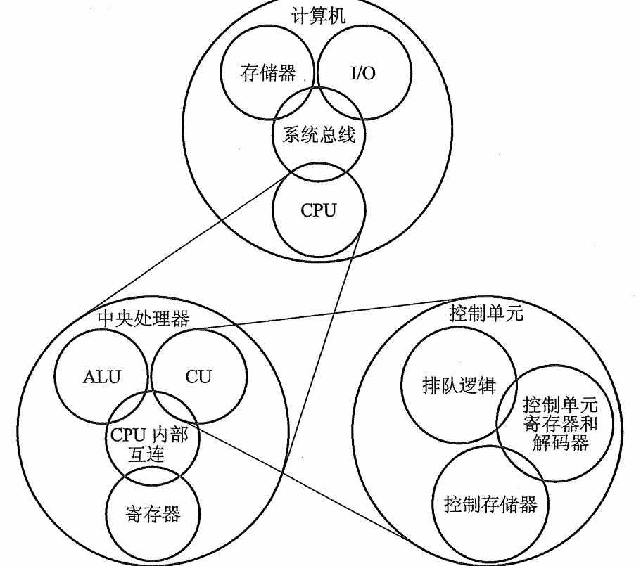

# 第一章 计算机系统概论
概括介绍整个计算机系统的组成和工作原理。
## 1.1 计算机系统简介
### 1.1.1 计算机的软硬件概念
计算机由`软件`和`硬件`两部分组成。
>**硬件**(Hardware)：指计算机系统中`物理`存在的各种`设备`，如CPU、内存、硬盘、显示器、键盘、鼠标等。
>>硬件的分类：
>>- 输入设备：如键盘、鼠标、扫描仪等。
>>- 输出设备：如显示器、打印机、音响等。
>>- 存储设备：如硬盘、内存等。
>>- 处理设备：如CPU、显卡等。
---
>**软件**(Software)：指计算机系统中`非物理`存在的各种`程序`，如操作系统、应用程序、数据库管理系统等。
>>软件的分类：
>>- 系统软件：如操作系统、编译器、解释器等。
>>- 应用软件：如文字处理软件、数据库管理软件、图形处理软件等。
### 1.1.2 计算机系统的层次结构
当代计算机在运行一段代码或者应用程序时，会经历以下几个层次的处理：
>本课程只讨论传统机器M1 和微程序机器M0的组成原理及设计思想，

  
---

## 1.2 计算机的基本组成
### 1.2.1 冯·诺依曼结构与现代计算机结构
1945年，美国数学家冯·诺依曼（von Neumann）提出了一种基于`存储程序`概念的计算机结构，被称为`冯·诺依曼结构`。

这个结构的奠定了现代计算机的基础。

#### 冯·诺依曼结构图
 
---
图中各部件的功能如下：
1. **运算器**用来完成算术运算和逻辑运算，并将运算的中间结果暂存在运算器内。
2. **存储器**用来存放数据和程序。
3. **控制器**用来控制、指挥程序和数据的输入、运行以及处理运算结果。
4. **输入设备**用来将人们熟悉的信息形式转换为机器能识别的信息形式，常见的有键盘、鼠标等。
5. **输出设备**可将机器运算结果转换为人们熟悉的信息形式，如打印机输出、显示器输出等。
---
冯·诺依曼结构的主要特点包括：
1. 计算机由**运算器、存储器、控制器、输入设备和输出设备**五大部件组成。
2. 指令和数据以同等地位存放在存储器内，并可按地址寻访。
3. 指令和数据均用二进制数表示。
4. **指令由操作码和地址码组成**，操作码用来表示操作的性质，地址码用来表示操作数在存储器中的位置。
5. **指令在存储器内按顺序存放**。通常，指令是顺序执行的，在特定条件下，可根据运算结果或根据设定的条件改变执行顺序。
6. **机器以运算器为中心**，输入输出设备与存储器间的数据传送通过运算器完成。
---
随着技术发展，现代的计算机已转化为以存储器为中心，而不是以运算器为中心。

#### 现代计算机五大部件结构图

---

计算机的五大部件在控制器的统一指挥下，有条不紊地自动工作。

运算器和控制器在逻辑关系和电路结构上联系十分紧密，尤其在大规模集成电路制作工艺出现后，这两大部件往往集成在同一芯片上，也就是**中央处理器**（**CPU**）。
输入设备与输出设备简称为 **I/0** 设备

因此，现代计算机的结构可以总结为3部分：
1. **CPU**
2. **内存（或称主存储器）**
3. **I/O设备**

#### 现代计算机组成框图

---
运算器和控制器名称也有不同的叫法：
1. 算术逻辑单元(Arithmetic Logic Unit, ALU) 简称算逻部件，用来完成算术逻辑运算。
2. 控制单元(Control Unit, CU) 用来解释存储器中的指令，并发出各种操作命令来执行指令。

### 1.2.2 计算机硬件的主要技术指标
#### 机器字长
机器字长是指CPU一次能处理数据的位数，通常与 CPU 的寄存器位数有关。字长越长，数的表示范围越大，精度也越高。机器的字长也会影响机器的运算速度。倘若CPU字长较短，又要运算位数较多的数据，那么需要经过两次或多次的运算才能完成，这样势必影响机器的运算速度。
机器字长对硬件的造价也有较大的影响。它将直接影响加法器（或 ALU）、数据总线以及存储字长的位数。所以机器字长的确定不能单从精度和数的表示范围来考虑。
#### 存储容量
存储容量是指存储器所能存储的二进制信息的总量。
通常用字节（Byte）为单位来表示。
1字节（Byte）= 8位（bit）
1位有0和1两种状态，那16位就是：$2^{16}$ ，即65536个状态。

现代计算机中常以字节Byte数来描述容量的大小，因一个字节已被定义为8位二进制代码，故用字节数便能反映主存容量。

假设，存储容量为 2M bit，即$2^{20}$，1024=1K，1024K=1M。
若将其转换为Byte，即：$2^{20}/8=2^{17}$，记作 $2^{17}$ B 、$2^{7}$ KB、 128 KB 。

#### 运算速度
现在机器的运算速度普遍采用单位时间内执行指令的平均条数来衡量，并用 MIPS（百万条指令每秒）作为计量单位。例如，某机每秒能执行 200 万条指令，则记作2 MIPS。
或用 FLOPS（浮点运算次数每秒）来衡量运算速度。

本课程涉及的主要模块

---